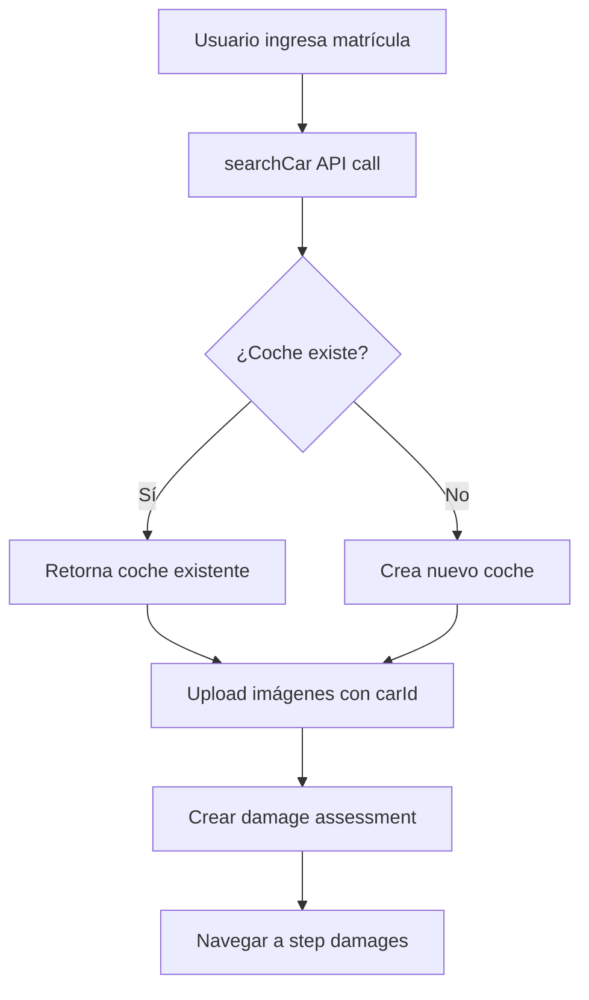

# Integración de Búsqueda de Coches en Wizard V2

## 🎯 Problema Resuelto

El upload de imágenes fallaba porque no se asociaba un `carId` requerido por S3. Esto ocurría porque el Wizard V2 no implementaba la búsqueda/creación de coches que existe en el flujo original de diagnósticos.

## ✅ Solución Implementada

### **1. Hook de Búsqueda de Coches**

Creado `useCarSearch` que replica la lógica del flujo original:

```typescript
// src/hooks/useCarSearch.ts
export const useCarSearch = (): UseCarSearchResult => {
  const searchCar = async (query: { plate?: string; vinCode?: string }): Promise<Car> => {
    const response = await ApiService.getInstance().get<Car>('/cars/vin-or-plate', {
      params: query
    });
    return response.data;
  };
  // ...
};
```

### **2. Contexto Actualizado**

Agregado `carId` al estado del wizard:

```typescript
// src/features/damage-wizard-v2/context/WizardV2Context.tsx
export interface WizardV2State {
  assessmentId?: string;
  carId?: string;        // ✅ Nuevo campo
  // ...
}

// Nueva acción para setear carId
type WizardV2Action = 
  | { type: 'SET_CAR_ID'; payload: string }  // ✅ Nueva acción
  // ...
```

### **3. Flujo de Intake Actualizado**

```typescript
// src/features/damage-wizard-v2/pages/Intake.tsx
const createAssessment = async () => {
  // 1. Buscar/crear el coche primero (como en el flujo original)
  const car = await searchCar({ plate: plate.toUpperCase() });
  
  // 2. Subir imágenes con el carId
  const uploadResult = await upload(selectedFiles, { carId: car._id }, 'damage-assessment');
  
  // 3. Crear el assessment con las URLs reales
  await startIntake({
    plate: plate.toUpperCase(),
    claimDescription: claim,
    images: uploadResult.keys,
  });
};
```

## 🔄 Flujo Completo



## 🛡️ Manejo de Errores

- **Sin coche**: Error claro al usuario sobre matrícula inválida
- **Upload falla**: Error específico sobre problema de subida
- **Backend error**: Mensajes descriptivos según el paso que falló

## 🧪 Testing

Script de prueba creado: `test-car-search-flow.ts`

```bash
# En la consola del navegador:
testCarSearchFlow()
```

## ⚡ Estados de Carga

- `isSearchingCar`: Mientras busca/crea el coche
- `isUploading`: Mientras sube las imágenes
- `isCreating`: Mientras crea el assessment

Button states: "Buscando coche..." → "Subiendo imágenes..." → "Creando assessment..."

## 🔗 Compatibilidad

- ✅ **Endpoint existente**: Usa `/cars/vin-or-plate` del flujo original
- ✅ **Lógica de backend**: Exactamente la misma que en diagnósticos
- ✅ **VIN y matrícula**: Soporta ambos métodos de búsqueda
- ✅ **Workshop isolation**: Respeta los talleres del usuario

## 📋 Archivos Modificados

1. `src/hooks/useCarSearch.ts` - ✅ Nuevo hook
2. `src/features/damage-wizard-v2/context/WizardV2Context.tsx` - ✅ Agregado carId
3. `src/features/damage-wizard-v2/pages/Intake.tsx` - ✅ Flujo completo
4. `src/scripts/test-car-search-flow.ts` - ✅ Script de prueba

**La integración está lista y funcional! 🎉**
