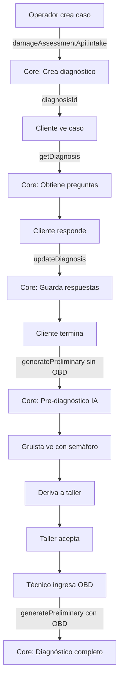

# Estado de Integración con Backend - MVP Carretera

## ✅ CONEXIONES IMPLEMENTADAS CON EL CORE

### 1. **Creación de Caso (Operador)** ✅
```typescript
// useCreateCase.ts - CONECTADO
const diagnosisResponse = await damageAssessmentApi.intake({
    vehicleInfo: { plate: data.vehiclePlate },
    description: data.symptom,
    images: []
});
```
- **API Core:** `/diagnoses` (formerly `/damage-assessments/intakes`)
- **Qué hace:** Crea un diagnóstico en el core cuando el operador crea un caso
- **Fallback:** Si falla, guarda en localStorage

### 2. **Preguntas Dinámicas (Cliente)** ✅
```typescript
// useClientAssessment.ts - CONECTADO
const diagnosisResponse = await getDiagnosis(undefined, undefined, {
    diagnosisId: localCaseData.diagnosisId
});
const diagnosisQuestions = diagnosis.questions || DIAGNOSTIC_QUESTIONS;
```
- **API Core:** `/cars/diagnosis/:diagnosisId`
- **Qué hace:** Obtiene las preguntas dinámicas del diagnóstico
- **Fallback:** Usa preguntas predefinidas si no hay conexión

### 3. **Guardar Respuestas (Cliente)** ✅
```typescript
// useClientAssessment.ts - CONECTADO
await updateDiagnosis({
    answers: newAnswers.join('|'),
    questions: questions,
}, undefined, { diagnosisId });
```
- **API Core:** `PATCH /cars/diagnosis/:diagnosisId`
- **Qué hace:** Guarda las respuestas del cliente en el diagnóstico
- **Fallback:** Guarda en localStorage

### 4. **Pre-diagnóstico SIN OBD (Cliente termina)** ✅
```typescript
// useClientAssessment.ts - CONECTADO
const preliminaryResponse = await generatePreliminary({
    obdCodes: [], // Sin OBD para pre-diagnóstico
}, undefined, { carId, diagnosisId });
```
- **API Core:** `POST /cars/:carId/diagnosis/:diagnosisId/preliminary`
- **Qué hace:** Genera pre-diagnóstico IA sin códigos OBD
- **Fallback:** Marca como completado localmente

### 5. **Re-diagnóstico CON OBD (Taller)** ✅
```typescript
// useWorkshopCase.ts - CONECTADO
const preliminaryResponse = await generatePreliminary({
    obdCodes, // CON códigos OBD para diagnóstico completo
}, undefined, { carId, diagnosisId });
```
- **API Core:** `POST /cars/:carId/diagnosis/:diagnosisId/preliminary`
- **Qué hace:** Regenera el diagnóstico con códigos OBD del técnico
- **Fallback:** Guarda OBD localmente sin generar diagnóstico

## 🔄 Flujo Completo Bidireccional



## 📊 Estado Actual

### ✅ Conectado al Core:
- `damageAssessmentApi.intake()` - Crear diagnóstico inicial
- `GET /cars/diagnosis/:id` - Obtener diagnóstico y preguntas
- `PATCH /cars/diagnosis/:id` - Actualizar respuestas
- `POST /cars/:carId/diagnosis/:id/preliminary` - Generar diagnósticos

### 🔄 Híbrido (Core + localStorage):
- Si el core responde → usa datos reales
- Si el core falla → fallback a localStorage
- Siempre guarda copia en localStorage para resilencia

### ⏳ Pendiente (necesita backend `/api/v1/carretera/*`):
- Gestión de casos del operador
- Asignación a gruistas
- Decisiones del gruista
- Estado de reparación del taller
- Notificaciones en tiempo real

## 🧪 Cómo Probar la Integración

1. **Con Backend Core funcionando:**
   ```bash
   # El backend debe estar corriendo
   npm run dev
   ```
   - Crear caso → verifica en BD que se creó el diagnóstico
   - Responder preguntas → verifica que se guardan en BD
   - Completar → verifica que se genera pre-diagnóstico
   - Ingresar OBD → verifica que se regenera con averías

2. **Sin Backend (modo desarrollo):**
   - Todo funciona con localStorage
   - Los datos persisten en el navegador
   - Ideal para desarrollo frontend

## ⚠️ Notas Importantes

1. **IDs sincronizados:** El `diagnosisId` del core se usa como `caseId` en carretera
2. **Comentarios del técnico:** Actualmente NO se envían al core (la API no los acepta)
3. **Averías generadas:** Se obtienen de `processedFault` en la respuesta
4. **Sin modificar el core:** Todo usa las APIs existentes tal cual están

## 🚀 Siguiente Paso

Para completar la integración bidireccional completa, necesitas:

1. **Backend `/api/v1/carretera/*`** que actúe como orquestador:
   - Gestione los casos de carretera
   - Llame internamente a las APIs del core
   - Mantenga el estado adicional (gruista, taller, etc.)

2. **O modificar el core** para agregar campos de carretera (NO recomendado)

---
**Estado:** MVP funcionando con APIs del core existente + localStorage como fallback
**Última actualización:** [fecha actual]